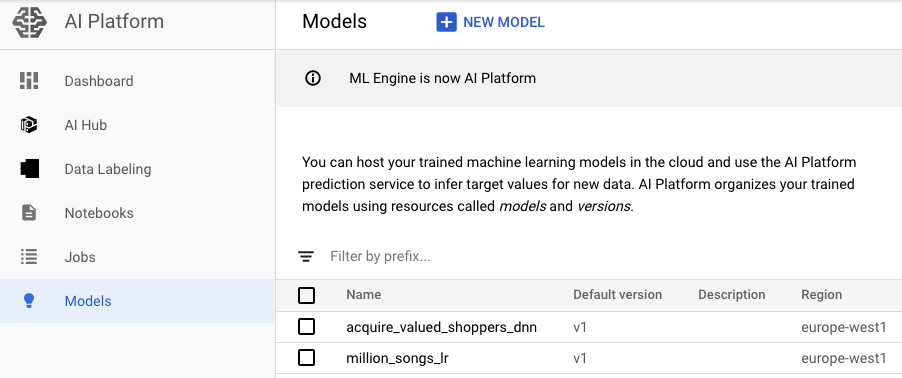

# TensorFlow Sampling - Examples

> *Effective sampling methods within TensorFlow input functions.*

## Table of Contents
* [Real-World Examples](#real-world-examples)
	* [Data](#data)
* [Getting Started](#getting-started)
	* [Prerequisites](#prerequisites)
	* [Installation](#installation)
* [Usage](#usage)
	* [Running Examples](#running-examples)

## Real-World Examples
Machine Learning examples on open-source datasets (local and AI Platform):
* [Acquire Valued Shoppers](examples/acquire-valued-shoppers)
* [Million Songs](examples/million-songs)

### Data
The datasets for both of the examples are in Google Cloud Storage:
* **Acquire Valued Shoppers** - [`gs://tf-sampling/acquire-valued-shoppers/data`](https://console.cloud.google.com/storage/browser/tf-sampling/acquire-valued-shoppers/data) (Public)
	* Positive instances (train) - [`gs://tf-sampling/acquire-valued-shoppers/data/train/positive`](https://console.cloud.google.com/storage/browser/tf-sampling/acquire-valued-shoppers/data/train/positive)
	* Negative instances (train) - [`gs://tf-sampling/acquire-valued-shoppers/data/train/negative`](https://console.cloud.google.com/storage/browser/tf-sampling/acquire-valued-shoppers/data/train/negative)
	* Dev set (evaluation during training) - [`gs://tf-sampling/acquire-valued-shoppers/data/dev`](https://console.cloud.google.com/storage/browser/tf-sampling/acquire-valued-shoppers/data/dev)
	* Test set - [`gs://tf-sampling/acquire-valued-shoppers/data/test`](https://console.cloud.google.com/storage/browser/tf-sampling/acquire-valued-shoppers/data/test)
* **Million Songs** - [`gs://tf-sampling/million-songs/data`](https://console.cloud.google.com/storage/browser/tf-sampling/million-songs/data/) (Public)
	* Positive instances (train) - [`gs://tf-sampling/million-songs/data/train/positive`](https://console.cloud.google.com/storage/browser/tf-sampling/million-songs/data/train/positive)
	* Dev set (evaluation during training) - [`gs://tf-sampling/million-songs/data/dev`](https://console.cloud.google.com/storage/browser/tf-sampling/million-songs/data/dev)
	* Test set - [`gs://tf-sampling/million-songs/data/test`](https://console.cloud.google.com/storage/browser/tf-sampling/million-songs/data/test)

## Getting Started

### Prerequisites
If you are running the examples in **cloud** mode:
* Set up Google Cloud Platform project and enable relevant APIs.
* Install [Google Cloud SDK](https://cloud.google.com/sdk/install) for running local jobs - installed by default on Google Cloud Compute Engine instances.
	*  `vm-startup.sh` available as VM start-up script to install dependencies when creating Compute Engine instances.
* Create service account with necessary permissions.

### Installation
* Clone this repository

```bash
git clone https://github.com/teamdatatonic/tf-sampling.git
```
* Execute `setup.sh` script which:
    *  Creates and activates virtual environment
    *  Installs `sampling` module with dependencies (from source)
    *  Downloads data for examples from Google Cloud Storage

```bash
cd tf-sampling
source setup.sh
```

**Optional -** if you are executing the examples using local AI Platform mode (`local-ai-platform-train.sh`) then appropriate credentials are required:
* Export service account key and either set the parameter, `credentials_json`, or the environment variable, `GOOGLE_APPLICATION_CREDENTIALS`, to the file path of the key.

```bash
export GOOGLE_APPLICATION_CREDENTIALS=/path/to/key.json
```

## Usage

### Running Examples
The two examples are structured identically. There are a series of bash scripts available both in the [Acquire Valued Shoppers folder](examples/acquire-valued-shoppers) and [Million Songs folder](examples/million-songs) for executing either **locally** or on **GCP** using AI Platform.

Please adjust the parameters as required in the bash scripts.

#### Points to Note

**Acquire Valued Shoppers:**
* Number of positive instances (`positive_size` arg) = 8511369
* Weight (`weight` arg - downsampling factor for `multiplier=1` to create balanced dataset) = 28.0

**Million Songs:**
* Number of positive instances (`positive_size` arg) = 2160509

#### Execution

Train model locally:
```bash
bash local-train.sh
```

Train model locally using AI Platform (which is useful for testing):
```bash
bash local-ai-platform-train.sh <GCP PROJECT ID>
```

Predict or evaluate locally by setting either `--mode=evaluate` or `--mode=predict`. The model parameters should be the same as during training, and `--job-dir` should point to the model checkpoints.
```bash
bash local-predict-evaluate.sh
```

Train model using AI Platform:
```bash
bash ai-platform-train.sh <GCP PROJECT ID>
```

Deploy model on AI Platform for serving:
```bash
bash ai-platform-deploy.sh <JOB NAME> <MODEL ID>
```


Generate batch predictions on AI Platform using deployed serving model:
```bash
bash ai-platform-predict.sh
```

Monitor training in **TensorBoard**:
```bash
tensorboard --logdir=/path/to/model/checkpoints/ --host=localhost --port=6006
```
